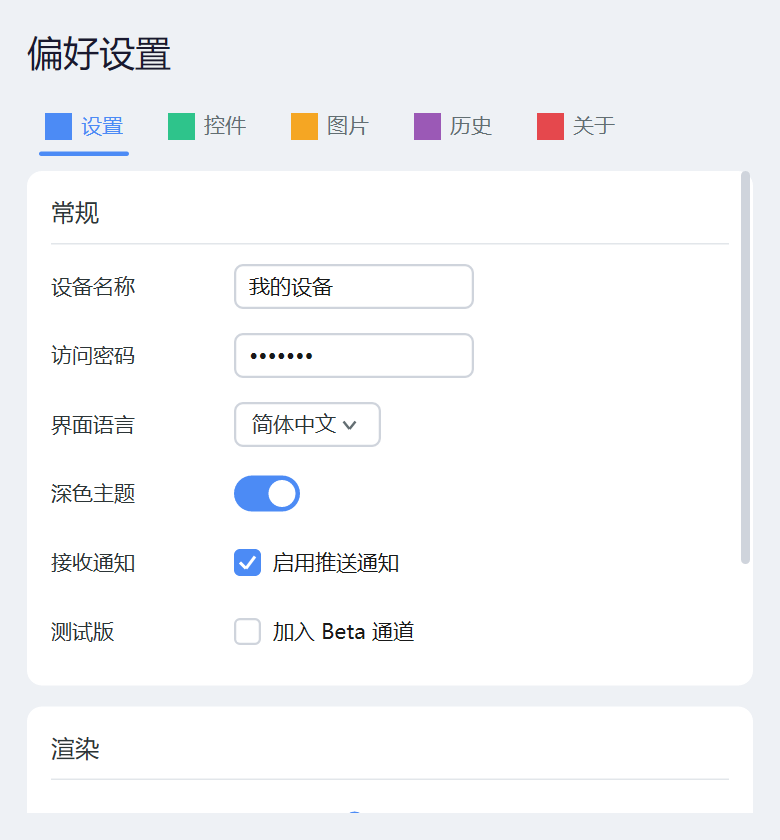
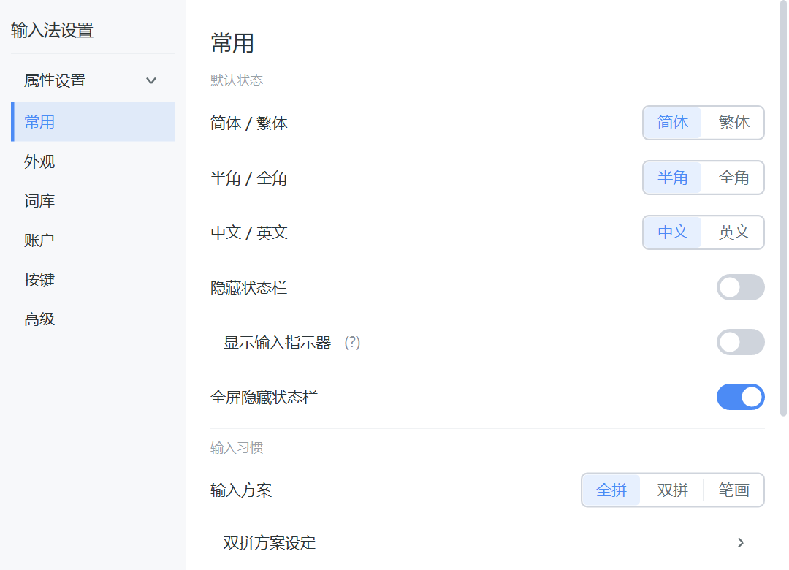
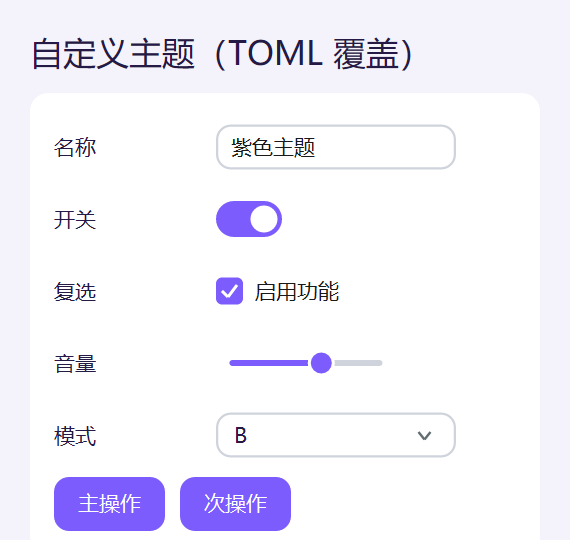
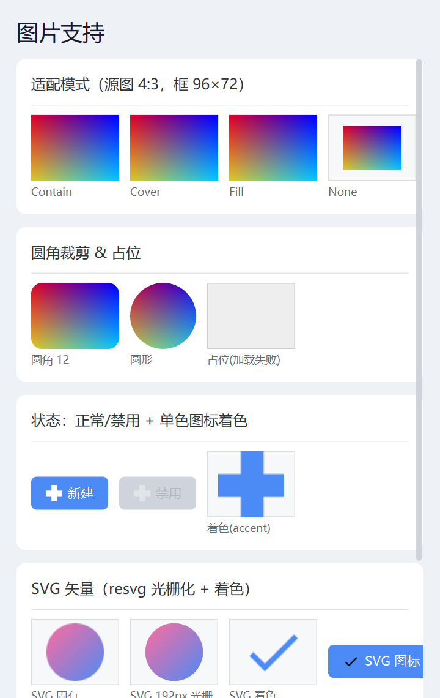
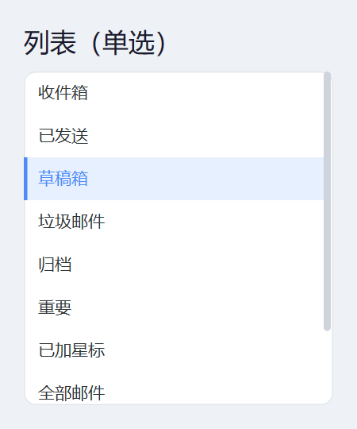
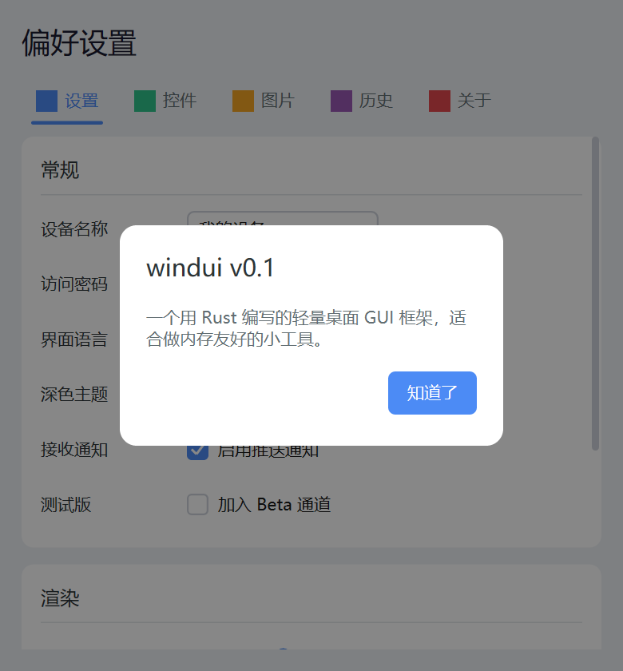

# windui

[简体中文](README.md) · **English**

[](https://github.com/huanfeng/wind-ui-rust/actions/workflows/ci.yml)
[](https://crates.io/crates/windui)
[](https://docs.rs/windui)
[](#license)

> A lightweight, cross-platform desktop GUI framework — build memory-friendly tools in Rust.

`Native platform windows` · `tiny-skia vector rendering` · `Native text shaping` · No runtime · No GC.

<p align="center">
  
</p>

| Platform | Window / Present | Text |
|----------|------------------|------|
| **Windows** | Win32 + GDI (DIB blit) | DirectWrite |
| **macOS** | Cocoa/AppKit + CoreGraphics (CGImage blit) | Core Text |

The rendering layer (`tiny-skia`) and all widget/layout/event logic are platform-agnostic; each platform only implements two seams: the "window + event loop" and the "text engine".

## Why

For small tools, Electron easily costs hundreds of MB, and Go GUIs need 15–40MB due to runtime/GC. windui has no runtime and no garbage collector. Measured on Windows:

| Metric | Measured |
|--------|----------|
| Binary size (release, LTO+strip) | minimal window app **0.44 MB**; comprehensive demo (with SVG + full widget set) **1.07 MB** |
| Private memory (PrivateBytes, 520×560 window) | **3.65 MB** |
| Cross-platform direct deps | tiny-skia (render) · resvg (SVG, on by default, stripped by LTO if unused) · serde + toml (theming); platform system bindings pulled in by target |

> Working set is ~14MB, mostly **shared** system DLL mappings (gdi32/dwrite, etc.); the process's truly private memory is only ~3.6MB.

## Features

- **Imperative Builder API** — pure-Rust method chaining, type-safe, zero parsing overhead.
- **One codebase, two platforms** — widget tree, layout, events, animation, theming are all platform-agnostic; switching platforms requires zero changes.
- **Retained mode + dirty triggering** — no redraw when idle, blocks on the event loop, zero CPU usage.
- **High-quality text** — native shaping (DirectWrite / Core Text) + grayscale anti-aliasing, crisp CJK; auto line-wrapping labels; **color emoji** (incl. ZWJ sequences and skin-tone modifiers), text fields accept emoji input.
- **DPI / Retina aware** — widget tree in logical coordinates, paint layer uniformly scales to physical pixels, text rendered at physical font size (measure and draw share one path), staying sharp at high DPI (1.5x/2x/Retina).
- **Clean focus ring** — the focus ring shows only during keyboard Tab navigation, never on mouse-only interaction.
- **Complete widget set** — layout, text, buttons, form inputs, container navigation, lists, images, tray.
- **Touch / trackpad** — pan scrolling + fling inertia + edge bounce.
- **Automatic screenshots** — `--screenshot` renders one frame off-screen to PNG (`--scale 1.5` for high-DPI), ideal for automated regression.

## Preview

All screenshots below are captured automatically via off-screen rendering (`--screenshot`, see [`scripts/screenshots.ps1`](scripts/screenshots.ps1)).

<table>
<tr>
<td width="50%"></td>
<td width="50%"></td>
</tr>
<tr>
<td><sub>Real scenario: sidebar nav + segmented control + switches + drill-in rows</sub></td>
<td><sub>TOML theme override: reskin the same widget set in one shot</sub></td>
</tr>
<tr>
<td></td>
<td></td>
</tr>
<tr>
<td><sub>Images: PNG/SVG, Fit modes, rounded clipping, monochrome tinting</sub></td>
<td><sub>List: single-select / highlight / scroll / icons</sub></td>
</tr>
<tr>
<td></td>
<td valign="center"><sub>Modal dialog + multi-tab navigation.<br>See the Widgets table below, or run <code>cargo run --release --example fullshowcase</code> to try it.</sub></td>
</tr>
</table>

## Quick start

```rust
use std::cell::Cell;
use std::rc::Rc;
use windui::prelude::*;

fn main() {
    let on = Rc::new(Cell::new(true));
    let ui = Element::col()
        .fill()
        .padding(20)
        .spacing(12)
        .bg(Color::hex(0xF5F6FA))
        .child(Element::label("Hello, windui!").font_size(22.0).height(32).width_match())
        .child(Element::checkbox("Enable feature", on.clone()))
        .child(Element::button("OK").on_click(|ctx| {
            println!("clicked");
            ctx.request_close();
        }));

    App::new("Demo", 360, 240).content(ui).run();
}
```

## Widgets

| Category | Widgets |
|----------|---------|
| Layout | `col` / `row` (LinearLayout, with weight), `stack` (FrameLayout) |
| Text | `label` (auto-wrap), `link` (clickable) |
| Button | `button` (hover/press/focus states + click/Enter/Space activation) |
| Form | `checkbox` / `switch` / `radio` (exclusive group) / `slider` (drag+keyboard) / `text_input` (CJK editing + password + multiline) / `dropdown` / `stepper` |
| Feedback | `progress` (determinate/indeterminate) / `tooltip` |
| Container | `scroll` (wheel/touch + clip + scrollbar) / `tabs` / `divider` / `dialog` (modal) / `visible_when` |
| Navigation | `segmented` / `nav_row` / `collapsible` / `accordion` |
| List | `list` (single-select / scroll / highlight / icons / disabled state) |
| Image | `image` / `image_view` (PNG/SVG, state modulation/tinting/rounding) |
| System | System tray (icon + left/double click + native context menu), frameless window (custom title bar), file drop, clipboard |

Form widgets bind two-way to external state via `Rc<Cell<T>>` / `Rc<RefCell<String>>`.

## Build & run

```bash
cargo run --release --example fullshowcase                  # run the comprehensive demo window
cargo run --example fullshowcase -- --screenshot out.png    # render off-screen to PNG
cargo test                                                  # run unit tests
cargo clippy --all-targets                                  # lint
```

Examples: `fullshowcase` (comprehensive), `animation`, `theming`, `image`, `list`, `dropdown`, `progress`, `multiline`, `emoji` (color emoji rendering), `frameless`, `light_titlebar`, `tray`, `file_drop`, `ime_settings`, plus `phase0`–`phase5` staged demos.

## Architecture

See [`docs/DESIGN.md`](docs/DESIGN.md) (design) and [`docs/ROADMAP.md`](docs/ROADMAP.md) (roadmap).

```
App layer       App / UiHost (interactive host, implements AppHandler)
Widget layer    Element Builder · Widget trait · layout algorithm
Core layer      Arena + Node tree · Measure/Arrange/Paint phases · event dispatch
Render layer    Canvas trait → tiny-skia backend (pure Rust, cross-platform)
Text layer      TextEngine trait → DirectWrite (Windows) / Core Text (macOS)
Platform layer  AppHandler trait → win32 (window/WndProc/DIB) / macos (NSWindow/NSView/CGImage)
```

Key design: nodes live in a **generational arena** (not `Rc<RefCell>`); the `Widget` trait degenerates to pure content, and layout recursion is driven by `Tree` holding `&mut self` exclusively — sidestepping Rust borrow conflicts at the root. Text is composited onto the tiny-skia premultiplied buffer with anti-aliasing by the native engine. The platform seam mapping is documented in [`docs/MACOS_PORTING.md`](docs/MACOS_PORTING.md).

## Status

Both Windows and macOS are supported. The MVP widget set is complete and actively being refined.

## Documentation

| Doc | Audience |
|-----|----------|
| [`docs/API_GUIDE.md`](docs/API_GUIDE.md) | Writing apps with the library (API style, widgets, extension) |
| [`docs/DEVELOPMENT.md`](docs/DEVELOPMENT.md) | Developing in the repo (build, layout, adding widgets, platform seam) |
| [`CONTRIBUTING.md`](CONTRIBUTING.md) | Contribution flow and DCO sign-off |
| [`docs/DESIGN.md`](docs/DESIGN.md) | Architecture and trade-offs |
| [`docs/ROADMAP.md`](docs/ROADMAP.md) | Roadmap and acceptance |
| [`docs/MACOS_PORTING.md`](docs/MACOS_PORTING.md) | macOS backend seam mapping |
| [`AGENTS.md`](AGENTS.md) | Repo development conventions (process, pitfalls) |

## License

Licensed under either of, at your option:

- Apache License, Version 2.0 ([`LICENSE-APACHE`](LICENSE-APACHE))
- MIT License ([`LICENSE-MIT`](LICENSE-MIT))

Unless you explicitly state otherwise, any contribution intentionally submitted for inclusion in this repository shall be dual licensed as above, without any additional terms or conditions (see [`CONTRIBUTING.md`](CONTRIBUTING.md)).
