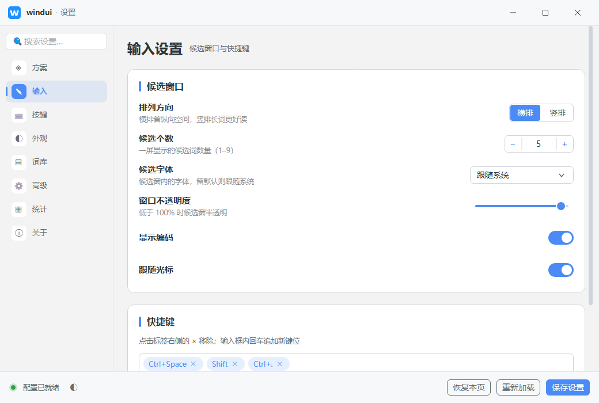
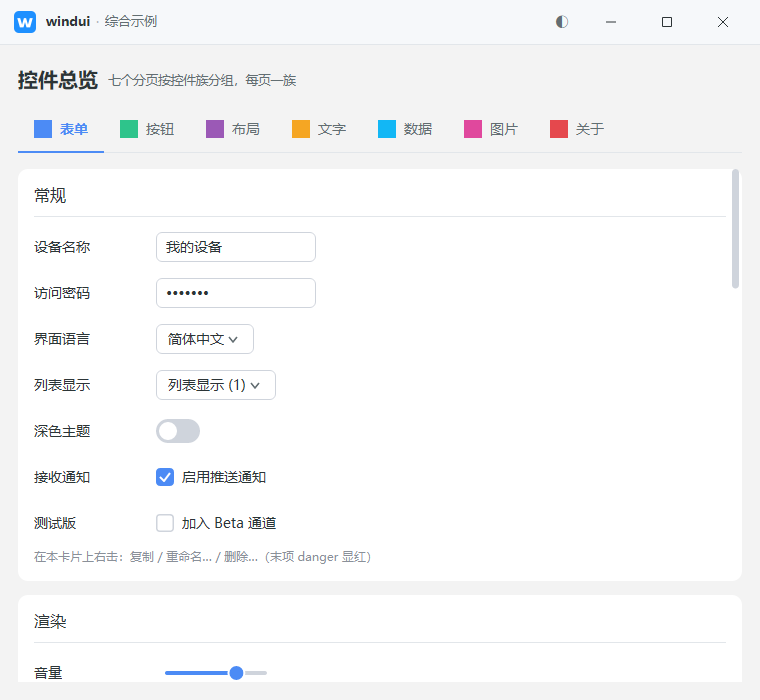
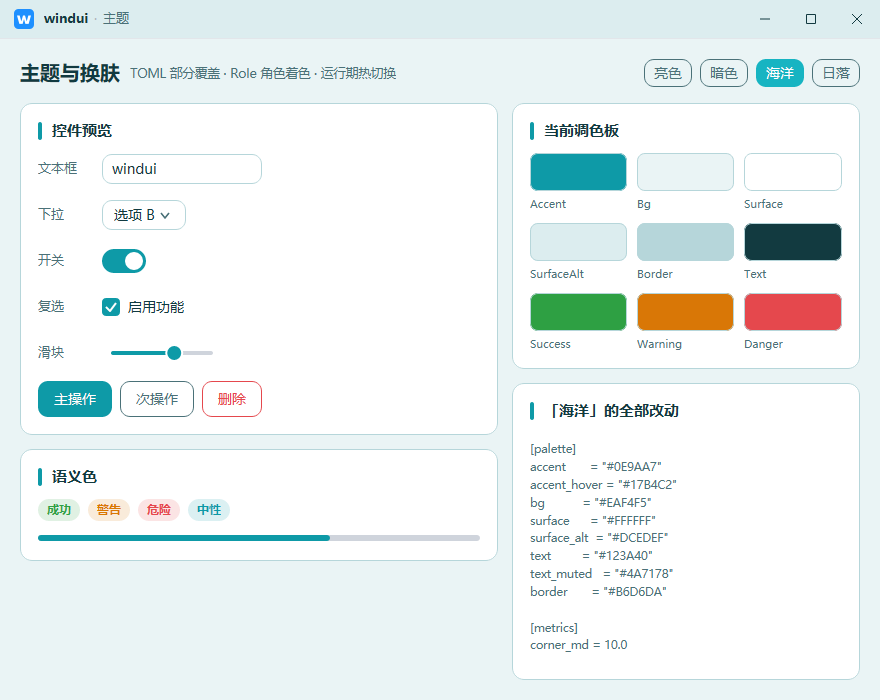
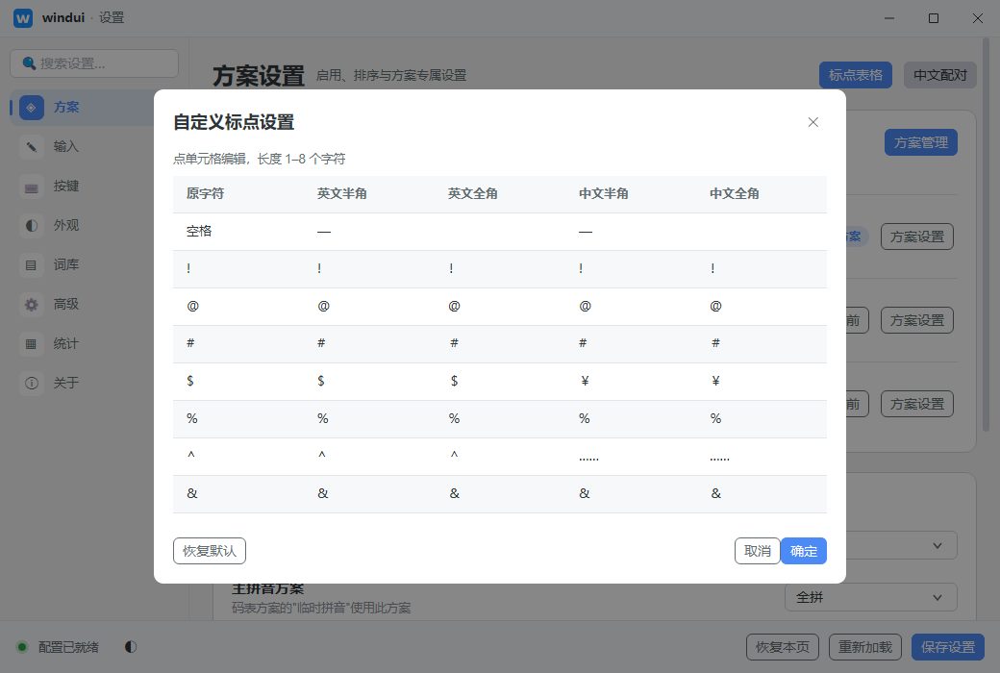
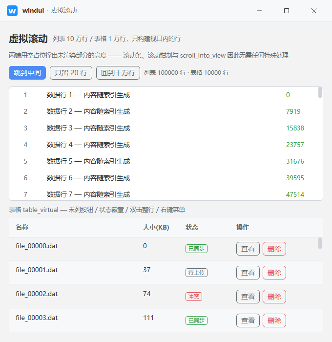
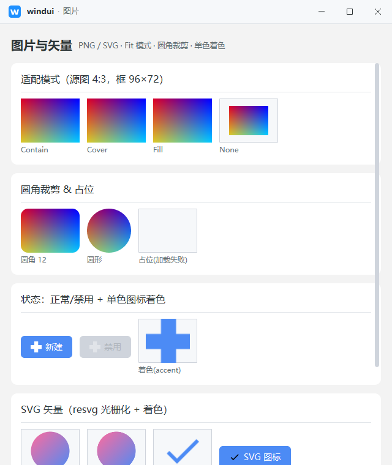
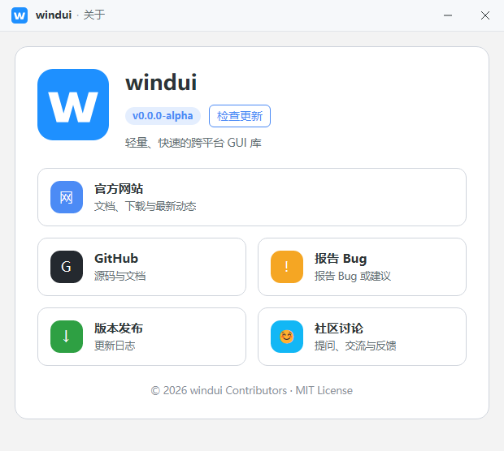

<p align="center">
  
</p>

# windui

[简体中文](README.md) · **English**

[](https://github.com/huanfeng/wind-ui-rust/actions/workflows/ci.yml)
[](https://crates.io/crates/windui)
[](https://docs.rs/windui)
[](#license)

> A lightweight, cross-platform desktop GUI framework — build memory-friendly tools in Rust.

`Native platform windows` · `tiny-skia vector rendering` · `Native text shaping` · No runtime · No GC.

<p align="center">
  
</p>

| Platform | Window / Present | Text |
|----------|------------------|------|
| **Windows** | Win32 + GDI (DIB blit) | DirectWrite |
| **macOS** | Cocoa/AppKit + CoreGraphics (CGImage blit) | Core Text |

The rendering layer (`tiny-skia`) and all widget/layout/event logic are platform-agnostic; each platform only implements two seams: the "window + event loop" and the "text engine".

## Why

For small tools, Electron easily costs hundreds of MB, and Go GUIs need 15–40MB due to runtime/GC. windui has no runtime and no garbage collector. Measured on Windows:

| Metric | Measured |
|--------|----------|
| Binary size (release, LTO+strip) | minimal window app **0.64 MB**; comprehensive demo (full widget set + SVG) **1.38 MB** |
| Private memory (PrivateBytes, 100% scaling) | minimal window 480×320 **2.7 MB**; about window 620×556 **5.5 MB** |
| Same, at 200% scaling | **4.6 MB** / **14.2 MB** |
| Cross-platform direct deps | tiny-skia (render) · resvg (SVG, on by default, stripped by LTO if unused) · serde + toml (theming); platform system bindings pulled in by target |

> **A memory number means nothing without its DPI.** The bulk of it is the ~2.5 full-window RGBA
> buffers the software rasterizer keeps, and those are allocated in **physical** pixels — at 200%
> scaling the same window covers 4× the physical area, and the memory scales with it. The two rows
> above are the same binaries measured at two scaling factors, not two different builds.
>
> The working set additionally covers **shared** system DLL mappings (gdi32/dwrite, etc. — about
> 22MB for the about window at 100%); the only memory the process truly owns is the private figure above.
>
> Every number is measured by [`scripts/measure_footprint.ps1`](scripts/measure_footprint.ps1) and reproducible by running it.

## Features

- **Imperative Builder API** — pure-Rust method chaining, type-safe, zero parsing overhead.
- **Copy-handle state** — state is a `Signal<T>`: closures `move`-capture it directly, no `clone()` ceremony; `set()` schedules a repaint automatically. Data changes drive subtree rebuilds (`list_signal`), so dynamic lists need no hand-written diffing.
- **Runtime theme switching** — grab a handle with `App::theme_handle()` and call `set(Theme::dark())` inside any callback to reskin the whole tree; colors expressed as a `Role` (`fg_role` / `bg_role`) follow along.
- **One codebase, two platforms** — widget tree, layout, events, animation, theming are all platform-agnostic; switching platforms requires zero changes.
- **Retained mode + dirty triggering** — no redraw when idle, blocks on the event loop, zero CPU usage.
- **High-quality text** — native shaping (DirectWrite / Core Text) + grayscale anti-aliasing, crisp CJK; auto line-wrapping labels; **color emoji** (incl. ZWJ sequences and skin-tone modifiers), text fields accept emoji input.
- **DPI / Retina aware** — widget tree in logical coordinates, paint layer uniformly scales to physical pixels, text rendered at physical font size (measure and draw share one path), staying sharp at high DPI (1.5x/2x/Retina).
- **Clean focus ring** — the focus ring shows only during keyboard Tab navigation, never on mouse-only interaction.
- **Complete widget set** — layout, text, buttons, form inputs, container navigation, lists, images, tray.
- **Touch / trackpad** — pan scrolling + fling inertia + edge bounce.
- **Optional GPU acceleration (Windows)** — large windows can opt into the Direct2D backend (`App::accelerated(true)`): geometry, gradients, shadows and glyph rasterization run on the GPU, while text still goes through DirectWrite (system font cache, ClearType). Software rendering is the default; RDP sessions, machines without a GPU and off-screen screenshots fall back automatically and never panic.
- **Automatic screenshots** — `--screenshot` renders one frame off-screen to PNG (`--scale 1.5` for high-DPI), ideal for automated regression.

## Preview

Every screenshot below is captured automatically via off-screen rendering (`--screenshot`, see [`scripts/readme_shots.ps1`](scripts/readme_shots.ps1)) with no retouching.
The main examples all use frameless windows with a self-drawn title bar — **the title bar is part of the widget tree**, laid out and themed exactly like the rest of the window.

<table>
<tr>
<td width="50%"></td>
<td width="50%"></td>
</tr>
<tr>
<td><sub>Widget tour: seven tabs grouped by widget family (forms / buttons / layout / text / data / images / about)</sub></td>
<td><sub>Theming: partial TOML overrides + <code>Role</code>-based coloring, hot-swapped across the whole tree at runtime</sub></td>
</tr>
<tr>
<td></td>
<td></td>
</tr>
<tr>
<td><sub>Modal dialog: backdrop scrim + titled panel + click-to-edit table cells</sub></td>
<td><sub>Virtual scrolling: 100k-row list / 10k-row table, only viewport rows are built</sub></td>
</tr>
<tr>
<td></td>
<td></td>
</tr>
<tr>
<td><sub>Images &amp; vectors: PNG/SVG, Fit modes, rounded clipping, monochrome tinting</sub></td>
<td><sub>About page: clickable cards + pill badges + outline buttons + toasts</sub></td>
</tr>
</table>

## Quick start

```rust
use windui::prelude::*;

fn main() {
    // State is a Signal<T>: a Copy handle, captured directly by closures;
    // writing to it schedules a repaint automatically.
    let on = signal(true);

    let ui = Element::col()
        .fill()
        .padding(20)
        .spacing(12)
        .bg(Color::hex(0xF5F6FA))
        .child(Element::label("Hello, windui!").font_size(22.0).width_match())
        .child(Element::checkbox("Enable feature", on))
        .child(Element::button("OK").on_click(move |ctx| {
            println!("checkbox = {}", on.get());
            ctx.request_close();
        }));

    App::new("Demo", 360, 240).content(ui).run();
}
```

## Widgets

| Category | Widgets |
|----------|---------|
| Layout | `col` / `row` (LinearLayout, with weight), `stack` (FrameLayout), `grid` (equal-width grid), `flex_spacer` |
| Text | `label` (auto-wrap), `label_signal` (signal-bound), `link` (clickable), `rich` (rich text: styled spans / collapsible sections) |
| Button | `button` (hover/press/focus states + click/Enter/Space activation), `icon_button` |
| Form | `checkbox` / `switch` / `radio` (exclusive group) / `slider` (drag+keyboard) / `text_input` (CJK editing + password + multiline) / `dropdown` / `check_menu` / `stepper` / `chip` / `tag_field` |
| Feedback | `progress` (determinate/indeterminate) / `tooltip` / `toast` (centered transient overlay) / `badge` |
| Container | `scroll` (wheel/touch + clip + scrollbar) / `tabs` / `tabs_pill` / `divider` / `dialog` (modal) / `dialog_panel` (titled) / `visible_when` |
| Navigation | `segmented` / `nav_row` (drill-in) / `collapsible` / `accordion` · `accordion_multi` |
| List | `list` / `list_pill` (sidebar style) / `list_icons` (single-select / scroll / highlight / icons / disabled state) / `list_signal` (data-driven dynamic list) / `reorder_list` (drag to reorder) |
| Table | `table` (read-only) / `table_custom` / `table_editable` / `table_sortable` / `table_sortable_server` (server-side sort + paging) / `table_selectable` (multi-select) |
| Image | `image` / `image_svg` / `image_view` (PNG/SVG, state modulation/tinting/rounding) |
| System | System tray (icon + left/double click + native context menu), global hotkeys, multi-window (`ctx.open_window`, incl. singleton windows), start hidden, close-to-hide, frameless window (custom title bar), file drop, clipboard |

Widget state binds uniformly to `Signal<T>` — a `Copy` handle created by `signal(initial)`:
`checkbox` / `switch` take `Signal<bool>`, `dropdown` / `list` / `tabs` take `Signal<usize>`,
`text_input` takes `Signal<String>`. Writing via `set()` schedules a repaint automatically, with
no manual dirty marking. See [`docs/API_GUIDE.md`](docs/API_GUIDE.md) §3.2.

## Build & run

```bash
cargo run --release --example fullshowcase                  # run the comprehensive demo window
cargo run --release --example ime -- --accelerated          # enable the Direct2D GPU backend (Windows)
cargo run --example fullshowcase -- --screenshot out.png    # render off-screen to PNG
cargo test                                                  # run unit tests
cargo clippy --all-targets                                  # lint
```

Examples fall into four groups:

| Group | Examples |
|-------|----------|
| **Complete apps** | `settings` (settings window: title bar + icon sidebar + content + action bar + two dialogs), `about` (about page), `ime_settings` (IME settings scenario), `light_titlebar` (installer-style light title bar) |
| **Widgets & capabilities** | `fullshowcase` (widget tour, seven tabs), `theming` (TOML themes + runtime reskin), `image` (images/SVG), `animation`, `emoji` (color emoji), `caret` (four caret styles) |
| **Data display** | `virtual_list` (virtual list + table), `virtual_table_server` (server-side paging), `table_pager` (pager bar), `dyn_list` (data-driven dynamic list), `list`, `dropdown`, `tabs_pill`, `toast`, `progress`, `multiline` |
| **System integration** | `tray` (system tray), `hotkey` (global hotkeys + start hidden), `multi_window` (child windows + shared state), `file_drop`, `frameless` (custom title bar + system menu), `background_task` (cross-thread updates), `ime` |

Plus `phase0`–`phase5` staged demos and the `perfprobe` performance probe, used for development and regression comparison.

## Architecture

See [`docs/DESIGN.md`](docs/DESIGN.md) (design) and [`docs/ROADMAP.md`](docs/ROADMAP.md) (roadmap).

```
App layer       App / UiHost (interactive host, implements AppHandler)
Widget layer    Element Builder · Widget trait · layout algorithm
Core layer      Arena + Node tree · Measure/Arrange/Paint phases · event dispatch
Render layer    Canvas trait → tiny-skia backend (pure Rust, cross-platform)
Text layer      TextEngine trait → DirectWrite (Windows) / Core Text (macOS)
Platform layer  AppHandler trait → win32 (window/WndProc/DIB) / macos (NSWindow/NSView/CGImage)
```

Key design: nodes live in a **generational arena** (not `Rc<RefCell>`); the `Widget` trait degenerates to pure content, and layout recursion is driven by `Tree` holding `&mut self` exclusively — sidestepping Rust borrow conflicts at the root. Text is composited onto the tiny-skia premultiplied buffer with anti-aliasing by the native engine. The platform seam mapping is documented in [`docs/MACOS_PORTING.md`](docs/MACOS_PORTING.md).

## Status

Both Windows and macOS are supported. The MVP widget set is complete and actively being refined.

## Documentation

| Doc | Audience |
|-----|----------|
| [`docs/API_GUIDE.md`](docs/API_GUIDE.md) | Writing apps with the library (API style, widgets, extension) |
| [`docs/DEVELOPMENT.md`](docs/DEVELOPMENT.md) | Developing in the repo (build, layout, adding widgets, platform seam) |
| [`CONTRIBUTING.md`](CONTRIBUTING.md) | Contribution flow and DCO sign-off |
| [`docs/DESIGN.md`](docs/DESIGN.md) | Architecture and trade-offs |
| [`docs/ROADMAP.md`](docs/ROADMAP.md) | Roadmap and acceptance |
| [`docs/MACOS_PORTING.md`](docs/MACOS_PORTING.md) | macOS backend seam mapping |
| [`AGENTS.md`](AGENTS.md) | Repo development conventions (process, pitfalls) |

## License

Licensed under either of, at your option:

- Apache License, Version 2.0 ([`LICENSE-APACHE`](LICENSE-APACHE))
- MIT License ([`LICENSE-MIT`](LICENSE-MIT))

Unless you explicitly state otherwise, any contribution intentionally submitted for inclusion in this repository shall be dual licensed as above, without any additional terms or conditions (see [`CONTRIBUTING.md`](CONTRIBUTING.md)).
